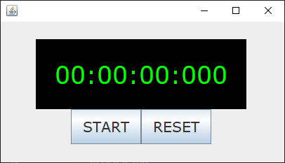
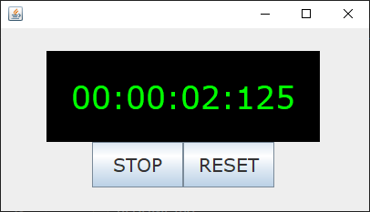

# Millisecond Digital Stopwatch

Java implementation a digital stopwatch with millisecond resolution and GUI display built using Java Swing.  

  

There are two threads in this application: one for the UI in that will update 
the text in the stopwatch GUI and one for the computation of the time. Having 
separate threads increases the display time to millisecond resolution.

The GUI has a time display with a format of `HH:MM:ss:SSS`, where `H` is hours, 
`M` is minutes, `s` is seconds, and `S` is milliseconds. The GUI includes START 
and RESET buttons to control the stopwatch. After the START button is clicked, 
the button will change to a STOP button that can pause the timer. The RESET button clears the timer to 00:00:00:000.

  

 

## Table of Contents
- [Prerequisites](#prerequisites-heading)
- [Dependencies](#dependencies-heading)
- [Usage](#usage-heading)

## Prerequisites
Java 21 (tested in in build 21.0.6+8-LTS-188)

## Dependencies
There are no external dependencies needed. Only built-in packages, such as the Java Swing and event listeners are imported.  

## Usage

The entry point where the stopwatch program is ran from is `Main.java`.  

The main routine creates a StopwatchPanel object, where the StopwatchTimer object 
is instantiated in the StopwatchPanel constructor.

